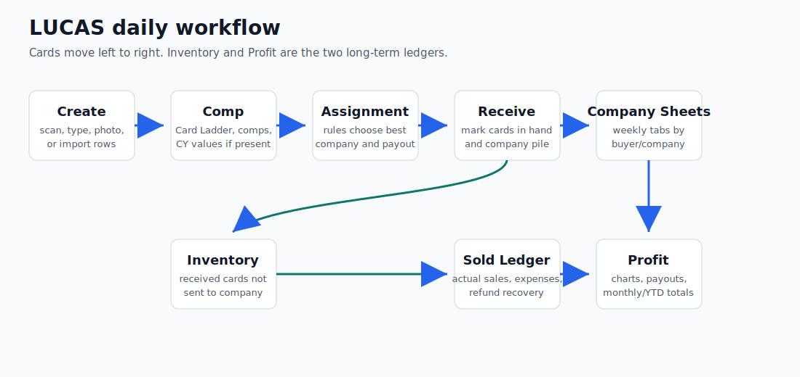
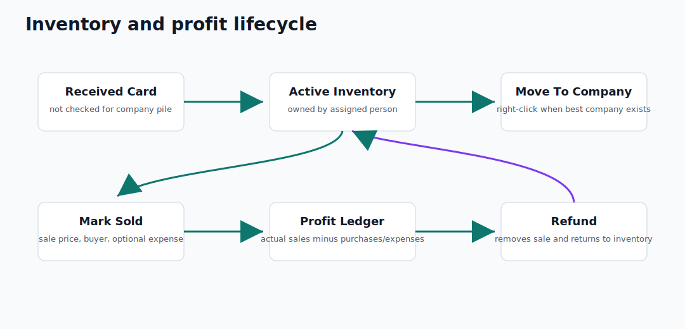
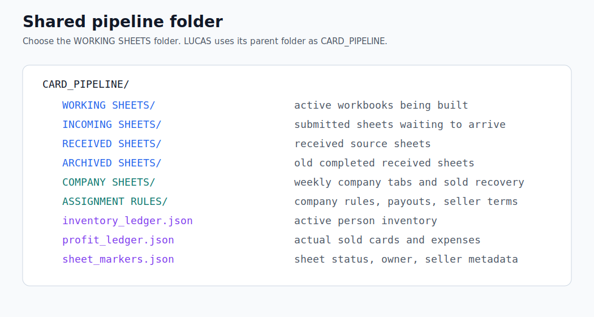
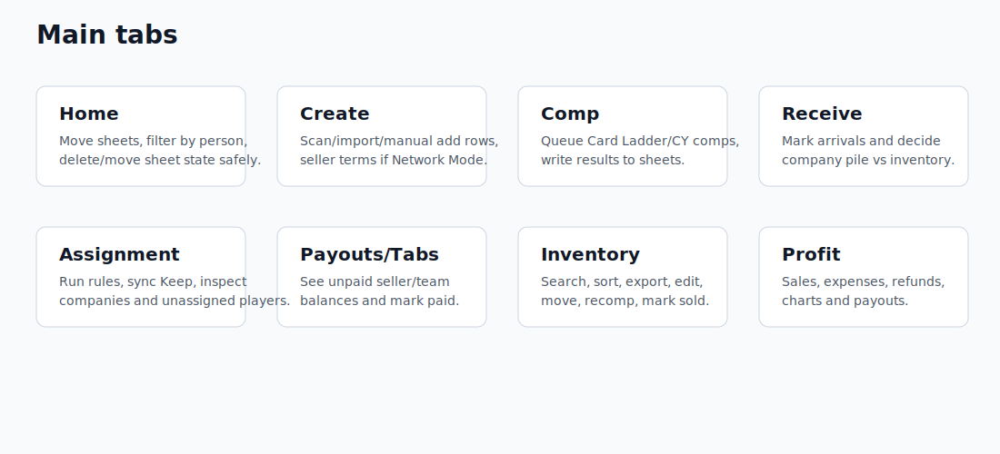
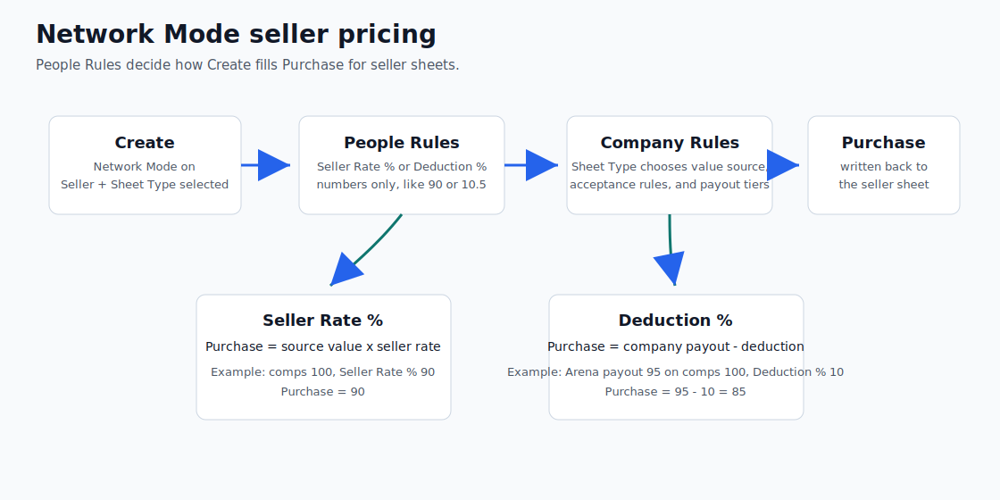
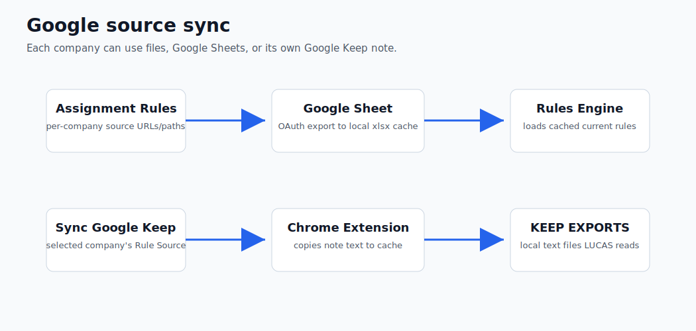

# L.U.C.A.S User Guide

L.U.C.A.S means **Lot Upload, Comping & Assignment System**. It helps you create card sheets, comp cards, assign each card to the best company, track inventory, record sales, manage seller/team payouts, and review profit.

This guide is written for both the Windows and Mac repositories. Platform differences are called out where they matter.



## Table Of Contents

1. [What LUCAS Tracks](#what-lucas-tracks)
2. [First-Time Setup](#first-time-setup)
3. [Daily Workflow](#daily-workflow)
4. [Home](#home)
5. [Create](#create)
6. [Comp](#comp)
7. [Receive](#receive)
8. [Assignment](#assignment)
9. [Payouts/Tabs](#payoutstabs)
10. [Inventory](#inventory)
11. [Profit](#profit)
12. [Network Mode And People Rules](#network-mode-and-people-rules)
13. [Google Sheets And Google Keep Sources](#google-sheets-and-google-keep-sources)
14. [Company Sheets](#company-sheets)
15. [Mac-Only Mobile Companion](#mac-only-mobile-companion)
16. [Troubleshooting](#troubleshooting)
17. [Best Practices](#best-practices)

## What LUCAS Tracks

LUCAS keeps several separate ideas straight:

- **Working sheet**: a sheet you are building or comping.
- **Incoming sheet**: a submitted sheet that has not been fully received.
- **Received sheet**: a sheet whose cards have arrived and been marked received.
- **Company sheet**: weekly workbook tabs for cards sent or sold to a buyer/company.
- **Inventory**: active cards that are in hand but not sold or moved to a company sheet.
- **Profit ledger**: actual realized sales and expenses. Unsold cards do not create realized profit.
- **Payouts**: what sellers or team members are owed.

The most important rule: **Inventory is for active unsold cards. Profit is for sold cards and expenses.**



## First-Time Setup

Use the platform setup file first:

- Windows: `FIRST_RUN_SETUP.md`
- Mac: `FIRST_RUN_SETUP.md`

At a high level:

1. Install dependencies.
2. Create or confirm the `.env` file.
3. Open LUCAS.
4. Use **Working Folder** and select the shared `WORKING SHEETS` folder.
5. Load the Card Ladder Chrome extension.
6. In **Assignment Rules**, connect Google if rules use Google Sheets.
7. Confirm assignment companies are active.
8. Run **System Health** and fix anything marked as needing attention.

### Shared Pipeline Folder

When you select `WORKING SHEETS`, LUCAS treats the parent folder as the shared `CARD_PIPELINE` root.



Expected structure:

```text
CARD_PIPELINE
  WORKING SHEETS
  INCOMING SHEETS
  RECEIVED SHEETS
  ARCHIVED SHEETS
  COMPANY SHEETS
  ASSIGNMENT RULES
  sheet_markers.json
  weekly_company_sheets.json
  profit_ledger.json
  inventory_ledger.json
  unassigned_players.json
  assignment_player_overrides.json
  .locks
```

Mac may also include:

```text
mobile_action_log.json
```

Each computer keeps its own local `.env`, OAuth token, identity, settings, and Chrome extension install.

## Daily Workflow

Most normal card flow looks like this:

1. **Create** a sheet from scans, manual entry, photo OCR, or an existing spreadsheet.
2. **Comp** the rows with Card Ladder and, on Mac only, CourtYard/CY if needed.
3. **Assignment** runs rules to choose best company and estimated payout.
4. Move the sheet to **Incoming**.
5. When cards arrive, use **Receive** to mark cards received.
6. Cards checked for company pile go to weekly company sheets.
7. Cards not checked for company pile go to **Inventory**.
8. From **Inventory**, right-click cards to mark sold, move to a company sheet, edit row values, copy values, explain assignment, or delete from inventory.
9. Use **Profit** to review sales, expenses, refunds, charts, and ledgers.
10. Use **Payouts/Tabs** to review seller/team balances and mark paid.



## Home

Home is the sheet control center.

Use Home to:

- View `Incoming`, `Working`, and `Received` sheets.
- Filter the app by person. This auto-sets person filters in Inventory, Profit, and Payouts, but users can still change those filters manually.
- Move sheets backward or forward if a sheet was marked incorrectly.
- Delete sheets with confirmation.
- Open the marker editor when sheet owner/status metadata needs correction.

Important behavior:

- Moving a sheet out of `Received` clears received/paid marker state.
- If needed, LUCAS removes company-sheet rows and profit-ledger rows created from that source sheet.
- Changing a sheet's assigned person retargets matching inventory rows instead of duplicating them.
- Deleted sheets do not get re-created in inventory during reconcile.

## Create

Create supports four input modes:

- **Barcode Scanner**
- **Manual Entry**
- **Photo OCR**
- **Existing Spreadsheet**

### Manual Entry

Use the `+ Add row` line and double-click cells to edit:

- Cert
- Grader
- Card description
- Purchase
- Card Ladder value
- Comps
- CY Estimate
- CY Confidence

### Add Card Directly To Inventory

Inventory also has **Add Card**. Use this when you already have the card and do not want to create a full sheet first.

Required:

- Person
- Card description
- Purchase price

Optional:

- Cert number
- Grader
- Card Ladder value
- Comps
- CY Estimate
- CY Confidence
- Notes

If no cert is entered, LUCAS generates a stable raw-card item ID like `RAW-YYYYMMDD-####`.

## Comp

The Comp tab queues rows for card-value lookup.

Windows:

- Runs Card Ladder through the Chrome extension.
- Does not run CourtYard/CY automation.
- Can still read and use CY Estimate/CY Confidence that already exists in a sheet.

Mac:

- Runs Card Ladder.
- Can run CourtYard/CY automation.
- Has comp-source choices for Card Ladder, CY, or both.

Comp strategy options include average/high/low/stale-newest style behavior depending on the current app controls. Current comp parsing is hardened against row bleed, stale noisy rows, date drift, and same-day duplicate issues.

## Receive

Use Receive when physical cards arrive.

Typical receive steps:

1. Load an incoming sheet.
2. Mark the received cards.
3. Check **Company Pile** for cards that should go to the winning company.
4. Click **Mark Received in Sheets**.

What happens next:

- Company pile cards go to weekly company sheets if they have a real best company.
- `NOBODY TAKES` cards do not move to company sheets.
- Received cards not sent to company sheets go to active Inventory for the assigned person.
- Marking a full sheet `All Received` from Home also syncs non-company rows into Inventory.

## Assignment

Assignment runs the company rules.

Use this tab to:

- Load received sheets for assignment review.
- Re-run/update best company and payout.
- Open **Assignment Rules**.
- Open saved Google Keep note sources from each company's **Rule Source** panel with **Sync Google Keep**.
- Review unassigned players.

### Explain Assignment

In Inventory, right-click a row and choose **Explain Assignment** to see why LUCAS chose a company or `NOBODY TAKES`. This shows each company decision, source value, payout, and rejection reason.

## Payouts/Tabs

Payouts show who is owed money.

There are two main payout types:

- **Seller terms payouts**: used when Network Mode seller terms are applied.
- **Team payouts**: normal team members are paid from realized sold profit, not unsold estimated value.

Important rules:

- Seller/non-team buy payouts appear after the seller sheet is received.
- Team member payouts are generated from sold-profit rows.
- Team payout is half realized sold profit, floored at zero.
- Unsold estimated payout does not create profit owed.

## Inventory

Inventory only shows active unsold cards. Sold cards should not be visible in Inventory.

Use Inventory to:

- Filter by person, sport, price, and search text.
- Sort by clicking column headers.
- Search cert/card descriptions.
- Export only the currently filtered rows.
- Refresh only visible/filtered rows.
- Add cards manually with **Add Card**.
- Recomp visible cards.
- Update estimated payout/best company.
- Right-click rows to copy cell/row, edit row, explain assignment, move to company sheet, mark sold, or delete from inventory.

### Recomp Visible Cards

Use **Recomp Visible Cards** when you want current Card Ladder/CY/Comps data for the filtered inventory rows.

For CY:

- Windows reads CY fields already present in sheets.
- Mac can run CY automation.
- CY Estimate and CY Confidence are both written back to inventory.
- Empty-only recomp treats a missing CY Confidence as missing CY data.

### Mark Sold

Right-click an inventory row and choose **Mark Sold**.

Enter:

- Sale price
- Company/buyer, optional
- Expense category, optional
- Expense amount, optional
- Expense notes, optional

If company/buyer is blank, LUCAS records the sale under that person's general sold sheet.

### Move To Company Sheet

Right-click an active inventory card and choose **Move to Company Sheet** when you want it added to a company workbook.

Notes:

- Rows with `NOBODY TAKES` should not show the move option.
- You may override the target company when needed.
- LUCAS marks the inventory record as moved to company sheet so it no longer behaves like active inventory.

## Profit

Profit reads the profit ledger and, when requested, company sheets.

Use Profit to:

- View daily/overall profit charts.
- View month, year, YTD, and total profit.
- Search sold cards.
- Review sold sheets.
- Add expenses.
- Delete expenses.
- Refund sold cards back to inventory.
- Run **Deep Sync** if company sheets need to be scanned/backfilled.

### Refresh vs Deep Sync

- **Refresh View**: fast ledger refresh. Use this for normal filtering/searching/chart review.
- **Deep Sync**: scans company sheets and backfills missing sold-ledger rows. Use this only when company sheet files changed outside the normal app flow.

### Expenses

Expense categories include:

- Travel
- Supplies
- Travel Meal
- Fees
- Shipping

Expenses can be:

- General person expenses.
- Tied to a sold sheet.
- Tied to an individual sold card.
- Added while marking an inventory card sold.

Expenses deduct from profit. Expenses cannot be refunded to inventory, but they can be deleted.

## Network Mode And People Rules

Network Mode is for buying from sellers at fixed terms.



When Network Mode is off:

- Create hides seller/sheet type controls.
- LUCAS behaves like normal Open Team mode.

When Network Mode is on:

- Create exposes Seller and Sheet Type.
- Seller terms can auto-fill purchase prices.
- Seller terms are edited from **Assignment Rules -> People Rules**.
- Seller terms are stored in `ASSIGNMENT RULES/seller_terms.csv` for the shared pipeline.

Seller terms columns:

```text
Seller, Sheet Type, Seller Rate, Deduction
```

The People Rules popup labels the percentage fields as **Seller Rate %** and **Deduction %**. Type numbers only, without a percent sign. Decimals are allowed.

Examples:

```text
90
92.5
10
10.5
```

Do not type:

```text
90%
10%
ten
```

How seller terms work:

- `Sheet Type` must match an active assignment company.
- The matching assignment company determines the value source and rules.
- `Seller Rate %` pays the seller that percentage of the matching company source value. Example: source value `100` and Seller Rate `90` writes Purchase `90`.
- `Deduction %` follows the Sheet Type company's payout logic, then subtracts that percentage of the company source value. Example: company payout `95` on source value `100` and Deduction `10` writes Purchase `85`.
- Use either `Seller Rate %` or `Deduction %` on a row, not both.
- If Seller or Sheet Type is blank, purchase prices stay normal.
- If terms are invalid, save stops with a clear prompt.

Use **People Rules Health** in Assignment Rules to find duplicate rows, inactive companies, missing companies, bad rates, and parsed terms.

## Google Sheets And Google Keep Sources

Assignment rules may come from local files, Google Sheets, or Google Keep notes.



### Google Sheets

Use Assignment Rules -> **Connect Google** once per computer.

LUCAS stores the local token as:

```text
lucas_google_sheets_token.json
```

If Google Sheets cannot be read:

1. Open **System Health**.
2. Check Google status.
3. Use **Reconnect Google** in Assignment Rules if needed.
4. Confirm the OAuth app/credentials are correct.

### Google Keep

Google Keep notes are synced by opening saved note URLs so the Chrome extension can cache note text locally. Sync is per company, because different companies can use different Keep notes.

Use:

```text
Assignment Rules -> select company -> Rule Source -> Sync Google Keep
```

If rules still look stale:

1. Confirm Chrome is open.
2. Confirm the Card Ladder/LUCAS extension is loaded.
3. Open **Assignment Rules**.
4. Select the company whose Keep note needs refreshing.
5. Click **Sync Google Keep** in that company's Rule Source panel.
6. Wait for notes to load.
7. Save/reload Assignment Rules or run System Health.

## Company Sheets

Company sheets live here:

```text
CARD_PIPELINE/COMPANY SHEETS/<Company>/<Company>.xlsx
```

Each company workbook has weekly tabs named like:

```text
Week of YYYY-MM-DD
```

CourtYard/CY company sheets use CY-compatible visible front columns:

```text
Grader | Cert | Description | Grade | Purchase | Estimate | Confidence
```

LUCAS tracking/profit columns are kept to the right as hidden columns so profit backfill, source tracking, refunds, and dedupe still work.

Fanatics company sheets use the Fanatics-facing front-column format:

```text
Category | Card | Grade | Cert # | CL Value | Payout
```

LUCAS tracking/profit columns trail after those visible fields so profit backfill, source tracking, refunds, and dedupe still work. New Fanatics weekly tabs use this format automatically, and older Fanatics weekly tabs are migrated when LUCAS touches the workbook.

Manual edits:

- It is okay to manually add cards to weekly company sheets.
- Manual rows without source-sheet tracking should not be backfilled into sold cards.
- LUCAS appends to the next open row rather than overwriting existing rows.
- Use **Deep Sync** if you need LUCAS to scan company sheets after external edits.

## Mac-Only Mobile Companion

The Mac repo includes a local/offline-capable mobile companion.

It can:

- Add inventory actions.
- Mark sold actions.
- Add expense actions.
- Store actions locally when the phone cannot reach desktop.
- Export or sync the queue later.

The phone does not run Card Ladder, CY, Chrome extension automation, or full desktop workflows.

Windows does not currently include this mobile companion.

## Troubleshooting

### Start With System Health

Click **System Health** before guessing.

It checks:

- Python/dependencies
- `.env`
- Google API key
- Google Sheets OAuth
- Chrome extension status
- Card Ladder helper version
- Shared pipeline folders
- Assignment rules
- Seller terms
- Inventory/profit ledgers
- Stale locks/conflict files

### "OAuth did not return an authorization code"

Try:

1. Assignment Rules -> Reconnect Google.
2. Use the Google account allowed by the OAuth app.
3. Confirm the browser shows the final success page.
4. Check whether `lucas_google_sheets_token.json` was created.
5. Run System Health and copy details if it still fails.

### Inventory Looks Missing

Check:

1. Is the sheet assigned to the right person?
2. Was the sheet marked received?
3. Were cards checked for company pile? Those go to company sheets, not active inventory.
4. Is the Inventory person filter hiding them?
5. Use **Sync Received to Inventory** if older received sheets need backfill.

### Sold Cards Still Show In Inventory

Sold cards should not show in Inventory. Try:

1. Refresh Inventory.
2. Check whether the row status is truly sold in `inventory_ledger.json`.
3. Confirm you are not looking at an exported old sheet.
4. Check Profit to confirm the sale exists.

### Best Company Looks Wrong

Use right-click **Explain Assignment** in Inventory.

Check:

- Sport/category.
- Card title and player detection.
- Value source used by the company.
- Company active/inactive state.
- Rule rejection reason.
- Seller terms, if Network Mode is on.

### Profit Looks Wrong

Remember:

- Unsold inventory does not create realized profit.
- Team payouts are based on sold profit.
- Seller buy payouts appear only when seller sheets are received.
- Expenses reduce profit.
- Refunds remove sales and return cards to inventory.
- Use **Deep Sync** if company sheets were manually edited.

### LUCAS Feels Slow

Use normal **Refresh View** instead of **Deep Sync** for daily Profit work.

Other tips:

- Filter Inventory before recomping.
- Recomp only visible rows.
- Avoid scanning company sheets unless you need backfill.
- Keep shared folders clean of duplicate/conflict files.
- Check `lucas_performance.log` for slow operations.

## Best Practices

- Use person filters on Home when working for one person.
- Keep sheet names clear and unique.
- Do not delete local config/token files unless reconnecting setup.
- Use right-click actions instead of manually changing ledgers.
- Use Manual Entry or Inventory -> Add Card for quick one-off cards.
- Use Deep Sync only when external sheet edits need to be recovered.
- Keep Assignment Rules and People Rules Health clean before big receive/sell sessions.
- Commit/push app changes before handing a build to another user.

## Platform Differences

| Area | Windows | Mac |
| --- | --- | --- |
| Card Ladder | Yes | Yes |
| CourtYard/CY automation | No | Yes |
| Reads CY fields from sheets | Yes | Yes |
| Google Keep sync action | Yes | Yes |
| Mobile companion | No | Yes |
| Shared folder concept | Google Drive or local shared folder | Google Drive for desktop commonly used |

## Quick Reference

| Task | Where |
| --- | --- |
| Choose pipeline folder | Header -> Working Folder |
| Diagnose setup | Header -> System Health |
| Create sheet | Create |
| Add one card directly to inventory | Inventory -> Add Card |
| Mark cards received | Receive |
| See why a company was chosen | Inventory -> right-click -> Explain Assignment |
| Move card to company sheet | Inventory -> right-click -> Move to Company Sheet |
| Mark inventory sold | Inventory -> right-click -> Mark Sold |
| Add expense | Profit -> Add Expense |
| Refund sold card | Profit -> Sold Cards right-click -> Refund Selected |
| Sync Google Keep notes | Assignment Rules -> company -> Rule Source -> Sync Google Keep |
| Check People Rules | Assignment Rules -> People Rules Health |
| Backfill company sheets | Profit -> Deep Sync |
